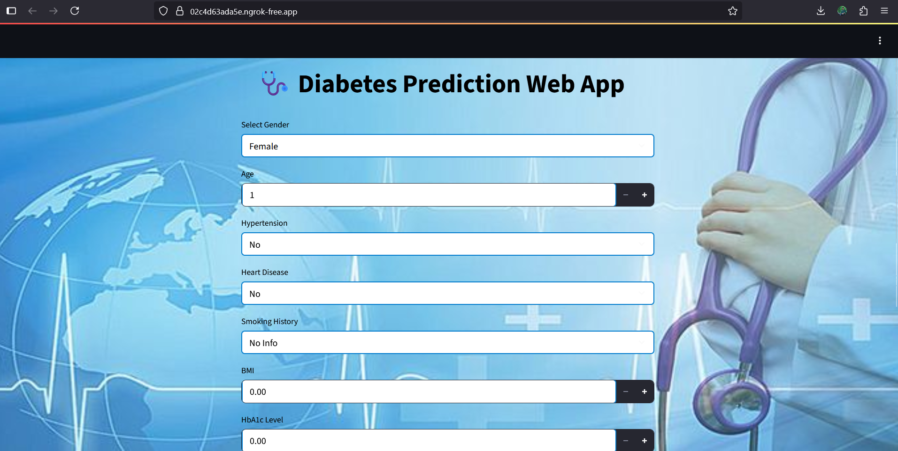

## 🩺 Diabetes Prediction Web App



### 📌 Overview

This project predicts the likelihood of diabetes in patients based on various health parameters.
It uses **Machine Learning (Gradient Boosting Classifier)** with hyperparameter tuning to achieve **97% test accuracy**.
The project also includes **EDA (Exploratory Data Analysis)** and is deployed with **Streamlit** for an interactive web interface.

---

## 📂 Table of Contents

1. Data Loading & Summary
2. EDA (Univariate & Bivariate Analysis)
3. Missing & Duplicate Values Handling
4. Outlier Detection
5. Correlation Analysis
6. Data Preprocessing & Encoding
7. Model Training & Evaluation
8. Streamlit Web App

---

## ⚙️ Tech Stack

* **Python**
* **Pandas, NumPy**
* **Matplotlib, Seaborn**
* **Scikit-learn**
* **Streamlit**
* **Pillow (Image handling)**
* **Pyngrok** (for Colab deployment)

---

## 📊 Model Performance

* **Train Accuracy**: 97.14%
* **Test Accuracy**: 97.07%
* **Precision**: 0.97
* **Recall**: 0.97
* **F1 Score**: 0.97

---
### ** Streamlit Web App**


## 🚀 How to Run Locally

### 1️⃣ Clone the Repository

```bash
git clone https://github.com/sarathkumar271002/Complete_ML_Project-Diabetes_prediction_web_app.git
cd Complete_ML_Project-Diabetes_prediction_web_app
```

### 2️⃣ Install Dependencies

```bash
pip install -r requirements.txt
```

### 3️⃣ Run Streamlit App

```bash
streamlit run app.py
```

## 📢 Author

👨‍💻 **Sarathkumar Soundarrajan**
📌 LinkedIn: (https://www.linkedin.com/in/sarathkumar271002/))
📌 GitHub: (https://github.com/sarathkumar271002)

